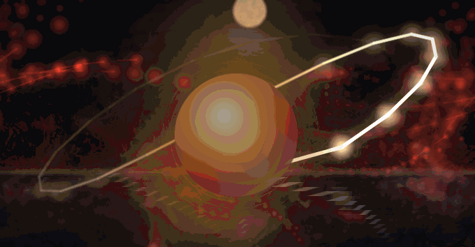

# 🔥 Phoenix — Born · Burned · Reborn

A living, single-file phoenix you can breathe with, stir, and travel through time.
No build step, no dependencies, no network — **one ~140 KB `index.html`** that runs
entirely in your browser, offline.

### [▶ Open it live →](https://epixsmedia.github.io/phoenix/)

↑ fan the flames into a blaze, step into the **4D block universe** (its whole life at once), then shatter it — all running live in the browser.

---

## What it is

An interactive, meditative WebGL + Canvas art piece built around one idea: a fire that
is forever dying and rising again. It carries an eternal **born → blaze → ash → reborn**
cycle and layers a whole world on top of it.

### The world

- **Volumetric fire** — a GPU shader of domain-warped fractal noise, flowing like rising heat
- **An ember phoenix** that gathers from the currents into a flapping, winged silhouette at the blaze, then bursts apart and reassembles
- **A reflection-twin** on moonlit water, meeting the bird at the glowing waterline
- **A companion phoenix** that rises from a bonfire and orbits the first, flaring in **union** when they pass
- **A day↔night sky** with a drifting sun/moon, stars, a Milky Way band, aurora, and shooting stars
- **A constellation-phoenix** that draws itself across the night sky when the fire rests
- **A lotus-mandala** that blooms at the heart of the blaze
- **Rain** that falls hissing, dims the fire, and raises steam
- Quiet **verses** that breathe with the cycle

### Things you can do

- **Move** to fan the flames · **click** to light a bonfire · **drag** the fires around
- **Double-click** to _shatter_ the whole fire — it cracks apart, then reassembles
- **Let Go** — type a burden and watch the words ignite, rise, and dissolve into embers
- **Breathe** into your mic to fan the fire (or let it dance to music in the room)
- **Journey** — a hands-free guided session through the full cycle
- **Time Machine** — rewind, freeze, or fast-forward the phoenix's life; a wormhole opens, the **wheel of time** turns
- **4D** — step outside time into the _block universe_: the entire life laid out at once along a worldline of ghost-selves

### Sound & comfort

- **Living Music** (Settings → Ambient Mix) — a generative score that follows the phoenix: the chord moves with each phase, arpeggios brighten with the heat, the key drops at night, and the pitch bends when you travel through time.
- **Reduce motion** (Settings → Comfort) — a calm mode that gentles all the motion and flashes; it turns on automatically if your system asks for reduced motion.
- **Installable** — on the live site it works fully **offline** and can be added to your home screen / installed as an app.

## Keyboard

| Key     | Action  | Key | Action            |
| ------- | ------- | --- | ----------------- |
| `Space` | breathe | `L` | let go            |
| `R`     | rebirth | `J` | journey           |
| `X`     | shatter | `M` | breath / mic      |
| `N`     | rain    | `D` | 4D block universe |
| `C`     | cinema  | `F` | fullscreen        |

Open the **Settings** panel (gear / `S`) to tune the fire, the rebirth cycle, the
day–night length, and the ambient mix. Your settings are remembered on your device.

## Run it

Just open `index.html` in any modern browser — or visit the
[live site](https://epixsmedia.github.io/phoenix/). Everything runs locally; nothing
is ever sent anywhere.

## License

[MIT](LICENSE) — do anything you like with it.
